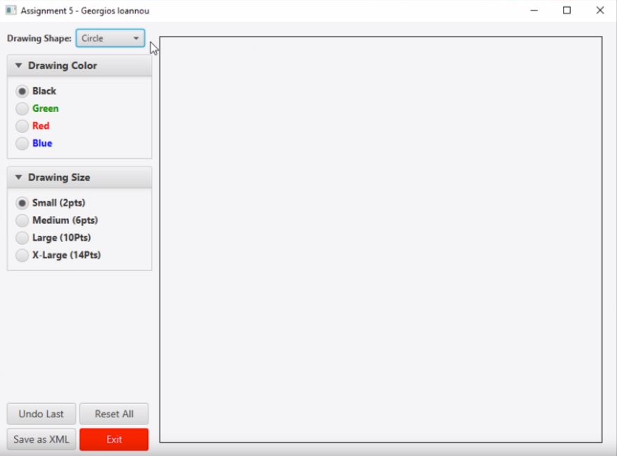

# JavaFX Painting Application
<a name="readme-top"></a>

[![Contributors][contributors-shield]][contributors-url]
[![Forks][forks-shield]][forks-url]
[![Stargazers][stars-shield]][stars-url]
[![Issues][issues-shield]][issues-url]
[![MIT License][license-shield]][license-url]
[![LinkedIn][linkedin-shield]][linkedin-url]
[![GitHub][github-shield]][github-url]

<br />
<div align="center">
  

<h3 align="center"><a href="https://github.com/GeorgiosIoannouCoder/javafx-painting-application/tree/main/ioannou_painting_application/src/main/java/edu/cuny/ccny/ioannou_painting_application">JavaFX Painting Application</a></h3>

  <p align="center">
    In this assignment I worked with JavaFX and serialization to create a painting application.
    <br />
    <a href="https://github.com/GeorgiosIoannouCoder/javafx-painting-application"><strong>Explore the docs »</strong></a>
    <br />
    <br />
    <a href="https://github.com/GeorgiosIoannouCoder/javafx-painting-application/issues">Report Bug</a>
    ·
    <a href="https://github.com/GeorgiosIoannouCoder/javafx-painting-application/issues">Request Feature</a>
  </p>
</div>

<details>
  <summary>Table of Contents</summary>
  <ol>
    <li>
      <a href="#about-the-project">About The Project</a>
      <ul>
        <li><a href="#requiremnets">Requirements</a></li>
        <li><a href="#built-with">Built With</a></li>
      </ul>
    </li>
    <li>
      <a href="#getting-started">Getting Started</a>
      <ul>
        <li><a href="#prerequisites">Prerequisites</a></li>
        <li><a href="#setup">SetUp</a></li>
      </ul>
    </li>
    <li><a href="#code">Code</a></li>
    <li><a href="#demo">Demo</a></li>
    <li><a href="#contributing">Contributing</a></li>
    <li><a href="#license">License</a></li>
    <li><a href="#contact">Contact</a></li>
  </ol>
</details>

## About The Project


## Requirements

You can find the requirements of this assignment [here](https://github.com/GeorgiosIoannouCoder/javafx-painting-application/blob/main/Ioannou_JavaFX_Requirements.pdf).

<p align="right"><a href="#readme-top">Back to top</a></p>

### Built With

[![Java][Java]][Java-url]
[![IntelliJIDEA][IntelliJIDEA]][IntelliJIDEA-url]
[![Git][Git]][Git-url]

<p align="right"><a href="#readme-top">Back to top</a></p>

## Getting Started

**To get a local copy of this project up and running locally follow these simple example steps:**

### Prerequisites

**NOTE:** How to check if Git is installed and what is its version

```sh
  git -v
```

1. Please make sure you have git installed

   - Windows: [https://git-scm.com/download/win](https://git-scm.com/download/win)
   - Mac: [https://git-scm.com/download/mac](https://git-scm.com/download/mac)
   - Linux: [https://git-scm.com/download/linux](https://git-scm.com/download/linux)

2. Please make sure you have [IntelliJ IDEA](https://www.jetbrains.com/idea/) installed. You can download IntelliJ IDEA [here](https://www.jetbrains.com/idea/download/).

***NOTE: You can use whatever code editor that you want. This project was created and tested with IntelliJ IDEA.***

### SetUp

1. Navigate to the directory where you want to clone/run/save the application

    ```sh
    cd your_selected_directory
    ```

2. Clone this repository

   ```sh
   git clone https://github.com/GeorgiosIoannouCoder/javafx-painting-application.git
   ```

3. Navigate to the javafx-painting-application git repository

   ```sh
   cd javafx-painting-application
   ```

4. Open your file explorer

   ```sh
   start .
   ```

5. Open IntelliJ IDEA.

6. Click on open/import an existing in IntelliJ IDEA.

7. Open the ioannou_painting_application directory found inside the javafx-painting-application directory from steps 3 and 4 inside IntelliJ IDEA.

8. Run the application inside IntelliJ IDEA. The main function to run the application is in this [file](https://github.com/GeorgiosIoannouCoder/javafx-painting-application/blob/main/ioannou_painting_application/src/main/java/edu/cuny/ccny/ioannou_painting_application/PainterAssignment5.java).
   
<p align="right"><a href="#readme-top">Back to top</a></p>

## Code

The main code files can be found [here](https://github.com/GeorgiosIoannouCoder/javafx-painting-application/tree/main/ioannou_painting_application/src/main/java/edu/cuny/ccny/ioannou_painting_application).

<p align="right"><a href="#readme-top">Back to top</a></p>

## Demo

https://github.com/GeorgiosIoannouCoder/javafx-painting-application/assets/110848236/4d9c5542-2978-4730-ac4a-4b10af38dd23

<p align="right"><a href="#readme-top">Back to top</a></p>

## Contributing

Contributions are what make the open source community such an amazing place to learn, inspire, and create. Any contributions you make are **greatly appreciated**.

If you have a suggestion that would make this better, please fork the repo and create a pull request. You can also simply open an issue with the tag "enhancement".
Don't forget to give the project a star! Thanks again!

1. Fork the Project
2. Create your Feature Branch (`git checkout -b feature/AmazingFeature`)
3. Commit your Changes (`git commit -m 'Add some AmazingFeature'`)
4. Push to the Branch (`git push origin feature/AmazingFeature`)
5. Open a Pull Request

<p align="right"><a href="#readme-top">Back to top</a></p>

## License

Distributed under the MIT License. See [LICENSE](https://github.com/GeorgiosIoannouCoder/javafx-painting-application/blob/master/LICENSE) for more information.

MIT License

Copyright (c) 2021 Georgios Ioannou

Permission is hereby granted, free of charge, to any person obtaining a copy
of this software and associated documentation files (the "Software"), to deal
in the Software without restriction, including without limitation the rights
to use, copy, modify, merge, publish, distribute, sublicense, and/or sell
copies of the Software, and to permit persons to whom the Software is
furnished to do so, subject to the following conditions:

The above copyright notice and this permission notice shall be included in all
copies or substantial portions of the Software.

THE SOFTWARE IS PROVIDED "AS IS", WITHOUT WARRANTY OF ANY KIND, EXPRESS OR
IMPLIED, INCLUDING BUT NOT LIMITED TO THE WARRANTIES OF MERCHANTABILITY,
FITNESS FOR A PARTICULAR PURPOSE AND NONINFRINGEMENT. IN NO EVENT SHALL THE
AUTHORS OR COPYRIGHT HOLDERS BE LIABLE FOR ANY CLAIM, DAMAGES OR OTHER
LIABILITY, WHETHER IN AN ACTION OF CONTRACT, TORT OR OTHERWISE, ARISING FROM,
OUT OF OR IN CONNECTION WITH THE SOFTWARE OR THE USE OR OTHER DEALINGS IN THE
SOFTWARE.

<p align="right"><a href="#readme-top">Back to top</a></p>

## Contact

Georgios Ioannou - [@LinkedIn](https://linkedin.com/in/georgiosioannoucoder)

Georgios Ioannou - [@georgiosioannoucoder](https://georgiosioannoucoder.github.io/) - Please contact me via the form in my portfolio.

Project Link: [https://github.com/GeorgiosIoannouCoder/javafx-painting-application](https://github.com/GeorgiosIoannouCoder/javafx-painting-application)

<p align="right"><a href="#readme-top">Back to top</a></p>

[contributors-shield]: https://img.shields.io/github/contributors/GeorgiosIoannouCoder/javafx-painting-application.svg?style=for-the-badge
[contributors-url]: https://github.com/GeorgiosIoannouCoder/javafx-painting-application/graphs/contributors

[forks-shield]: https://img.shields.io/github/forks/GeorgiosIoannouCoder/javafx-painting-application.svg?style=for-the-badge
[forks-url]: https://github.com/GeorgiosIoannouCoder/javafx-painting-application/network/members

[stars-shield]: https://img.shields.io/github/stars/GeorgiosIoannouCoder/javafx-painting-application.svg?style=for-the-badge
[stars-url]: https://github.com/GeorgiosIoannouCoder/javafx-painting-application/stargazers

[issues-shield]: https://img.shields.io/github/issues/GeorgiosIoannouCoder/javafx-painting-application.svg?style=for-the-badge
[issues-url]: https://github.com/GeorgiosIoannouCoder/javafx-painting-application/issues

[license-shield]: https://img.shields.io/github/license/GeorgiosIoannouCoder/javafx-painting-application.svg?style=for-the-badge
[license-url]: https://github.com/GeorgiosIoannouCoder/javafx-painting-application/blob/master/LICENSE

[linkedin-shield]: https://img.shields.io/badge/-LinkedIn-black.svg?style=for-the-badge&logo=linkedin&colorB=0077B5
[linkedin-url]: https://linkedin.com/in/georgiosioannoucoder

[github-shield]: https://img.shields.io/badge/-GitHub-black.svg?style=for-the-badge&logo=github&colorB=000
[github-url]: https://github.com/GeorgiosIoannouCoder/

[Java]: https://img.shields.io/badge/java-5382a1?style=for-the-badge&logo=openjdk&logoColor=f89820
[Java-url]: https://www.java.com/

[IntelliJIDEA]: https://img.shields.io/badge/intellij%20idea-000000?style=for-the-badge&logo=intellijidea&logoColor=
[IntelliJIDEA-url]: https://www.jetbrains.com/idea/

[Git]: https://img.shields.io/badge/git-000000?style=for-the-badge&logo=git&logoColor=orange
[Git-url]: https://git-scm.com/
